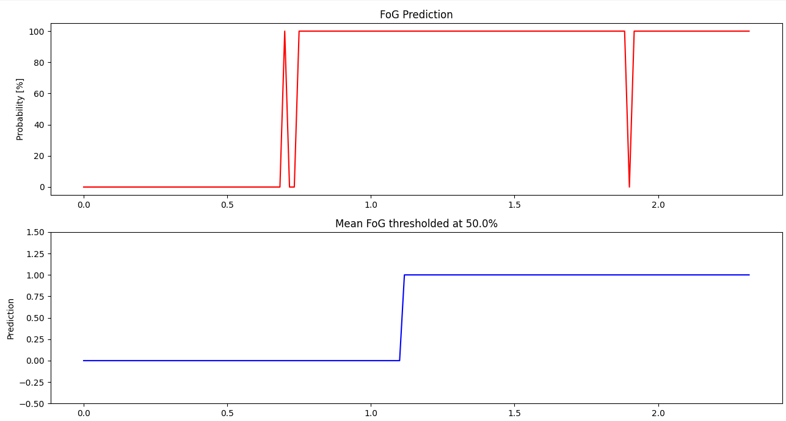

# **AI driven detection of Freezing of Gait in Parkinson's disease**

>*<span style="color:#dd5;">This project is focused on the AI-driven detection of Freezing of Gait (FoG) in Parkinson's disease patients. It is based on an idea developed by Dr. C. Awai and realized by A. Khazrane during a 2-month internship.</span>*


# Table of contents

1. [Requirements](#requirements)
2. [Introduction](#introduction)
3. [Dataset](#dataset)
   1. [Data processing](#data-processing)
      1. [First process](#first-process)
      2. [Second process](#second-process)
   2. [Model training](#model-training)
4. [Real-time FoG detection](#real-time-fog-detection)
   1. [Setup](#setup)
      1. [Running code with xsensdot_pc_sdk library](#running-code-with-xsensdot_pc_sdk-library)
      2. [Re-setup the Xsens DOT](#re-setup-the-xsens-dot)
      3. [Real-time data collection example](#real-time-data-collection-example)
   2. [FoG_predict_proba](#fog_predict_proba)
      1. [Global variables](#global-variables)
      2. [Load the model](#load-the-model)
      3. [Data collection](#data-collection)
   3. [FoG_predict](#fog_predict)
   4. [Communication of data (Computer to Computer)](#communication-of-data-computer-to-computer)
5. [Outlook](#outlook)


# Requirements


- Python 3.10
- [Xsens DOT IMUs](https://shop.movella.com/product-lines/wearables/products/movella-dot-sensor?utm_source=website&utm_medium=productpage&utm_campaign=titlebanner)
- [Xsens DOT PC SDK](https://www.movella.com/support/software-documentation)
- matplotlib
- numpy
- pandas
- sklearn
- scipy
- joblib

# Introduction

This part of the Holo-Gait project is the heart of the operation of the system. We want to detect Freezing of Gait (FoG) in real time thanks to an AI and send commands to the haptic devices developped by L.Dubarle and the Hololens environnment created by I.El-Bahri to alert the patient and help him to overcome the FoG episode.

# Dataset - *check `Data_processing/` directory*


link of the used dataset : [Daphnet dataset created by D.Rogger, M.Plotnik and J.Hausdorff](https://archive.ics.uci.edu/dataset/245/daphnet+freezing+of+gait)


Informations about the dataset:
- 16 files <=> 16 trials from 10 patients
- 3 IMUs : **Shank, Thigh and Trunk**
- Each IMU gives 3 acceleration values : x, y and z
- Label : 0 = out of trial, 1 = no freezing of gait, 2 = freezing of gait
- files are .txt files
>**Note :** Next part is not necessary if have chosen another dataset but could be useful if you want to understand how I proceeded

<span style="color:#f44;">A major improvement for this project should be to create a proper dataset for the FoG detection.</span>


## Data processing


### **First process :**

>Launch the file `txt2csv_daphnet.py` to convert the .txt files into .csv files and only retrieve the trial data by removing the rows in which FoG is 0 : Then NoFoG is a 0 and FoG a 1 in the new csv files.

The .csv files will be saved in the folder `daphnet_csv`.  

### **Second process : features extraction**

>Launch the file `features_extraction.py` to extract the features from the .csv files.

#### *Global variables*
   - <span style="color:#28f;">**WINDOW**</span> : size of the window in which we calculate the features.  
   I have chosen 150 points (2,34s) because this size gave me the best results in terms of accuracy.
   - <span style="color:#28f;">**STEP_SIZE**</span> : sliding step between windows.
   - <span style="color:#28f;">**sampling_rate**</span> : sampling rate of the dataset IMUs. Here, it is 64Hz.
   - <span style="color:#28f;">**frequency_range**</span> : set from 0.1Hz to 8Hz because we want to keep the low frequencies which correspond to walk and FoG frequencies

#### Features
The features extracted are the following :
```python
new_features = ['sk_x_mean', 'sk_x_std', 'sk_x_mdn', 'sk_x_min', 'sk_x_max', 'sk_x_aad', 'sk_x_rms', 'sk_x_iqr', 'sk_x_skw', 'sk_x_krt', 'sk_x_var', 
                'sk_y_mean', 'sk_y_std', 'sk_y_mdn', 'sk_y_min', 'sk_y_max', 'sk_y_aad', 'sk_y_rms', 'sk_y_iqr', 'sk_y_skw', 'sk_y_krt', 'sk_y_var',
                'sk_z_mean', 'sk_z_std', 'sk_z_mdn', 'sk_z_min', 'sk_z_max', 'sk_z_aad', 'sk_z_rms', 'sk_z_iqr', 'sk_z_skw', 'sk_z_krt', 'sk_z_var',
                'th_x_mean', 'th_x_std', 'th_x_mdn', 'th_x_min', 'th_x_max', 'th_x_aad', 'th_x_rms', 'th_x_iqr', 'th_x_skw', 'th_x_krt', 'th_x_var',
                'th_y_mean', 'th_y_std', 'th_y_mdn', 'th_y_min', 'th_y_max', 'th_y_aad', 'th_y_rms', 'th_y_iqr', 'th_y_skw', 'th_y_krt', 'th_y_var',
                'th_z_mean', 'th_z_std', 'th_z_mdn', 'th_z_min', 'th_z_max', 'th_z_aad', 'th_z_rms', 'th_z_iqr', 'th_z_skw', 'th_z_krt', 'th_z_var',
                'tk_x_mean', 'tk_x_std', 'tk_x_mdn', 'tk_x_min', 'tk_x_max', 'tk_x_aad', 'tk_x_rms', 'tk_x_iqr', 'tk_x_skw', 'tk_x_krt', 'tk_x_var',
                'tk_y_mean', 'tk_y_std', 'tk_y_mdn', 'tk_y_min', 'tk_y_max', 'tk_y_aad', 'tk_y_rms', 'tk_y_iqr', 'tk_y_skw', 'tk_y_krt', 'tk_y_var',
                'tk_z_mean', 'tk_z_std', 'tk_z_mdn', 'tk_z_min', 'tk_z_max', 'tk_z_aad', 'tk_z_rms', 'tk_z_iqr', 'tk_z_skw', 'tk_z_krt', 'tk_z_var']


new_features_2 = [  'sk_mean', 'sk_std', 'sk_mdn', 'sk_min', 'sk_max', 'sk_aad', 'sk_rms', 'sk_iqr', 'sk_skw', 'sk_krt', 'sk_var',
                    'th_mean', 'th_std', 'th_mdn', 'th_min', 'th_max', 'th_aad', 'th_rms', 'th_iqr', 'th_skw', 'th_krt', 'th_var',
                    'tk_mean', 'tk_std', 'tk_mdn', 'tk_min', 'tk_max', 'tk_aad', 'tk_rms', 'tk_iqr', 'tk_skw', 'tk_krt', 'tk_var']

new_features_3 = ['mean', 'std', 'mdn', 'min', 'max', 'aad', 'rms', 'iqr', 'skw', 'krt', 'var']

new_fft_features = ['fft_sk_mean', 'fft_sk_std', 'fft_sk_mdn', 'fft_sk_min', 'fft_sk_max', 'fft_sk_aad', 'fft_sk_rms', 'fft_sk_iqr', 'fft_sk_skw', 'fft_sk_krt', 'fft_sk_var',
                'fft_th_mean', 'fft_th_std', 'fft_th_mdn', 'fft_th_min', 'fft_th_max', 'fft_th_aad', 'fft_th_rms', 'fft_th_iqr', 'fft_th_skw', 'fft_th_krt', 'fft_th_var',
                'fft_tk_mean', 'fft_tk_std', 'fft_tk_mdn', 'fft_tk_min', 'fft_tk_max', 'fft_tk_aad', 'fft_tk_rms', 'fft_tk_iqr', 'fft_tk_skw', 'fft_tk_krt', 'fft_tk_var']

new_fft_features_2 = ['fft_mean', 'fft_std', 'fft_mdn', 'fft_min', 'fft_max', 'fft_aad', 'fft_rms', 'fft_iqr', 'fft_skw', 'fft_krt', 'fft_var']
label = ['FoG']

all_features = new_features + new_features_2 + new_features_3 + new_fft_features + new_fft_features_2
```

They are calculated as follow :
```python
def extract_features(X):
   feat = []
   #mean
   feat.append(np.mean(X))
   #standard deviation
   feat.append(np.std(X))
   #median
   feat.append(np.median(X))
   #min
   feat.append(np.min(X))
   #max
   feat.append(np.max(X))
   #average absolute deviation
   feat.append(np.mean(np.absolute(X - np.mean(X))))
   #root mean square
   feat.append(np.sqrt(np.mean(np.square(X))))
   #interquartile range
   feat.append(np.percentile(X, 75) - np.percentile(X, 25))
   #skewness
   feat.append(np.mean(np.power((X - np.mean(X)) / np.std(X), 3))) if np.std(X) != 0 else feat.append(0)
   #kurtosis
   feat.append(np.mean(np.power((X - np.mean(X)) / np.std(X), 4))) if np.std(X) != 0 else feat.append(0)
   #variance
   feat.append(np.var(X))
   return feat
```
For each acceleration time-serie, we calculate all these features and calculate the FFT of the time-serie to extract the same type of features from the FFT.
The output files are .csv files in which each row is a window of 150 points (~2.34s) sliding with a 75 points step. The FoG flag is calculated by taking the mean of FoGs in the window and if it is > 0.1 then the window is a FoG window. The threshold is this low because the dataset is very unbalanced and we want to have a lot of FoG windows to train the model.

The .csv files will be saved in the folder `daphnet_windowed/`.
Then, you'll need to move the files you need to train the model in the folder `train/` and the files you need to test the model in the folder `test/`. (*`S05R01.csv`* gave me the best accuracy results)

Thus, if you want to use another dataset, make sure to have the same format as the Daphnet dataset and to have the same features as the ones above if you want the following steps to work.


## Model training


Here, I tested different models to see which one gives the best accuracy. The models tested have each one file which name is the name of the model. The file contains the code to train the model and to test it. 

I used machine learning models which were classifiers coming from the **sklearn** library.

The ones which gave the best results are the following :
- [**Random Forest Classifier**](https://scikit-learn.org/stable/modules/generated/sklearn.ensemble.RandomForestClassifier.html) :

| Class | Precision | Recall | F1-score | Support |
|-------|-----------|--------|----------|---------|
|   0   |   0.94    |  0.81  |   0.87   |   611   |
|   1   |   0.70    |  0.90  |   0.79   |   292   |
|       |           |        |          |         |
|accuracy|    -     |   -    |   0.84   |   903   |
|macro avg|  0.82   |  0.86  |   0.83   |   903   |
|weighted avg|  0.86|  0.84  |   0.85   |   903   |
- [**Histogram Gradient Boosting Classifier**](https://scikit-learn.org/stable/modules/generated/sklearn.ensemble.HistGradientBoostingClassifier.html#sklearn.ensemble.HistGradientBoostingClassifier) :

| Class | Precision | Recall | F1-score | Support |
|-------|-----------|--------|----------|---------|
|   0   |   0.94    |  0.81  |   0.87   |   611   |
|   1   |   0.70    |  0.90  |   0.79   |   292   |
|       |           |        |          |         |
|accuracy|    -     |   -    |   0.84   |   903   |
|macro avg|  0.82   |  0.86  |   0.83   |   903   |
|weighted avg|  0.86|  0.84  |   0.85   |   903   |

Those two models gave the same results (the first is very good in classification of unbalanced data and the other one good in complex time-series). The accuracy is 0.84 which is not bad when we know that the dataset is very unbalanced and have only 10 patients data. By touching hyperparameters, we can improve the recall or the precision but it will decrease the other one. So, we have to find the best trade-off between the two.
Here, it is better to have a good recall because we want to detect as much FoG as possible.

Then, the trained model is saved (joblib library) .pkl format in the Data_processing folder.


# Real-time FoG detection


## Setup


### Running code with xsensdot_pc_sdk library

After performing the steps below you should be able to run the Python examples
of the Xsens DOT PC SDK.

 1. Install a Python interpreter (Python 3.9 is recommended)
 2. Install Requirements using pip
    1. `pip install -r requirements.txt`  
    **Note:** The step below is for the Python 3.9 Windows 64bit Release
    2. `pip install xsensdot_pc_sdk-2021.1.0-cp39-none-win_amd64.whl`
 3. Run the `xsensdot_pc_sdk_receive_data.py` to test if you can receive data from the Xsens DOT

### Re-setup the Xsens DOT

#### Change the IMU's name
Change the name at the line 134 of the file `xsensdot_pc_sdk_write.py` in the variable **new_tag_name**. The name must be a string and pay attention to turn off all the IMUs but one when running the code.
Un-comment the line above and comment line 134 to reset the name of the IMUs. (You have to turn them on there)

### Real-time data collection example

When you run the code `receive_data.py`, IMUs will be automatically detected. Then, you'll have to arrange IMU by recognizing which one is for which part of the body.
You can identifiate that during the real-time data collection. The IMU that is moving is the one that you got in the hand. The plot figure is organized with the name of the body part above: you know where to place the IMU.

Data collected in real time are plotted in a figure. Each IMU have its acceleration in x, y and z axis. The figure is updated every 0.1 second and shows 100 points as shown below : 
(Title of the plots are the name of the IMU)

`receive_data+f0.py` calculate the FFT of the acceleration of 1 IMU

## Shank, thigh and trunk data vizualisation and data collection

> Run the file `sk_th_tk-IMU.py` to launch the real-time data collection. Makes appear an animated plot with the real-time acceleration of the 3 IMUs.


For our case, I had to rename 3 IMUs with the name of the body part they were placed on : shank, thigh and trunk. Thus, this script allows to check which IMU is which body part and to collect data from them in a csv file.

><span style="color:#dd5;">Sometimes IMUs drift at the beginning of measurement. When it happens, just run codes again</span>

## *FoG_predict_proba*

> Run the file `FoG_predict_proba.py` to launch the real-time FoG detection. Make appear an animated plot with the real-time FoG prediction in percentage. 


**Note :** You can choose to plot real-time FFT of the acceleration by un-commenting all the lines which refer to the FFT in the code. (l.235, 240, 444, 450, 462-466)

### Global variables

 - <span style="color:#28f;">**WINDOW_SIZE**</span> : size of the window in which we calculate the features.  
 I have chosen 141 points (2,35s) because we extracted features in the dataset with 150 points windows sampled at 150Hz, so we have to keep the same amount of time in a window.
 - <span style="color:#28f;">**THRESHOLD**</span> : threshold by which we decide if the FoG flag is 1 or 0.   
 The threshold is 0.55 : if the mean of a certain number of point FoG probability is > THRESHOLD then the FoG flag is 1 and 0 otherwise. It allows to avoid peaks in FoG detection even if probability is already filtered in order to have a more stable FOG prediction and to compensate a lack of accuracy of the model.
 - <span style="color:#28f;">**COEFF_ACC**</span> : coefficient by which we multiply the acceleration values to normalize data and make it coherent with the dataset.  
 Coeff = (MAX_X_DATASET+MAX_Y_DATASET)/(max_x_imu+max_y_imu)
 - <span style="color:#28f;">**fs**</span> : sampling frequency of the IMUs : 60Hz
 - <span style="color:#28f;">**frequency_range**</span> : same as in the features extraction part.

### Load the model
```python
model = joblib.load('model/hgb_classifier.pkl') #l.70
```

### Data collection

During the real-time data collection, data can be also saved in a csv file.
l.524 : 
```python 
new_df.to_csv('2nd-trial.csv', index=False) 
```
Features recorded are the following : l.497
```python
new_df = pd.DataFrame(columns=['time', 'shank_x', 'shank_y', 'shank_z', 'thigh_x', 'thigh_y', 'thigh_z', 'trunk_x', 'trunk_y', 'trunk_z', 'FoG_prob'])
```


## *FoG_predict*

> This code is exactly the same as `FoG_predict_proba.py` but prediction is not a probability but a binary output. All the parameters and variables are the same.




## Communication of data (Computer to Computer)


For this part, I used simple Python socket communication : 
```python	
import socket

UDP_IP_1 = "192.168.1.201" # Haptic device 1
UDP_IP_2 = "192.168.1.202" # Haptic device 2
HOLO_IP = "192.168.1.102" # Hololens IP address (fix adress with ZyXEL router)
UDP_PORT = 8080

sock1 = socket.socket(socket.AF_INET, socket.SOCK_DGRAM)
```
Then, here is the functions to send commands to the haptic devices and to the Hololens :
```python	
def send_command(sock, ip, command):
    try:
        sock.sendto(command.encode(), (ip, UDP_PORT))
    except:
        pass

def vibrate_system(ip):
    frequency = 1.0
    command = f"V {frequency}"
    send_command(sock1, ip, command)

def stop_vibration(ip):
    command = "S"
    send_command(sock1, ip, command)

def visual_cues():
    command = "FOG"
    send_command(sock1, HOLO_IP, command)
```
I look at my two last FoG values to send commands to avoid sending them in a loop (cf. l.224): 
```python
if old_FoG_flag == 0 and FoG_flag == 1:
        vibrate_system(UDP_IP_1)
        vibrate_system(UDP_IP_2)
        visual_cues()
elif old_FoG_flag == 1 and FoG_flag == 0:
        stop_vibration(UDP_IP_1)
        stop_vibration(UDP_IP_2)
```


# Outlook
- Create a proper dataset for the FoG detection
   - Collect data from patients
   - Retrieve acceleration and gyro data from IMUs -> continue `manual-ble-measurement.py` which refers on the [Movella DOT BLE service specs](https://www.movella.com/support/software-documentation) document
- Improve the model
   - Use a deep learning model
   - Find most efficient features