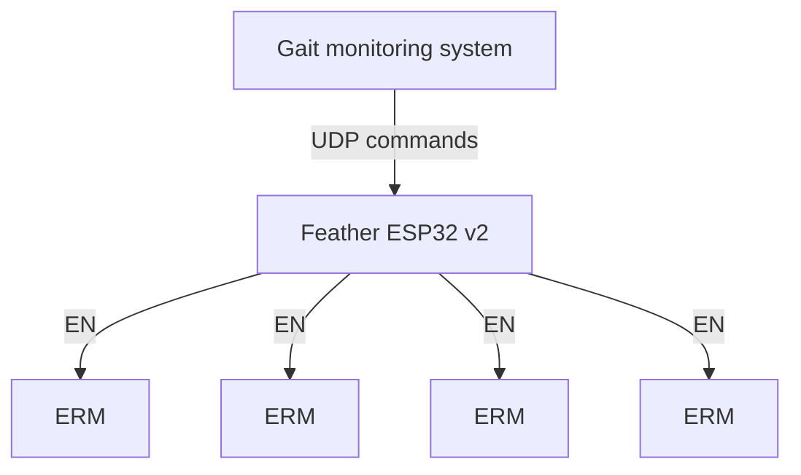

# HoloGait-Project

## Haptic Feedback System for FoG Recovery in Parkinson's Disease

### Overview

This project is a part of the HoloGait project, which aims to develop a wearable device that can help Parkinson's patients overcome freezing of gait (FoG) episodes. This repository contains the code for the haptic feedback system. Other two components are the gait monitoring system and the visual feedback system. The haptic feedback system is designed to provide a rhythmic cue to the patient's ankle to help them overcome FoG episodes. The system is designed to be used in conjunction with the gait monitoring system, which detects FoG episodes and sends a signal to the haptic feedback system to provide the cue. The visual feedback system is designed to provide a visual cue to the patient's glasses to help them overcome FoG episodes.

### Hardware

The haptic feedback system consists of a Feather ESP32 v2 microcontroller, ERMs and a 3.7V 300mAh LiPo battery. The microcontroller is programmed to receive an UDP command from the gait monitoring system and provide a rhythmic cue to the patient's lower leg. The LiPo battery is used to power the system.

#### Idea graph

#### Circuit diagram

